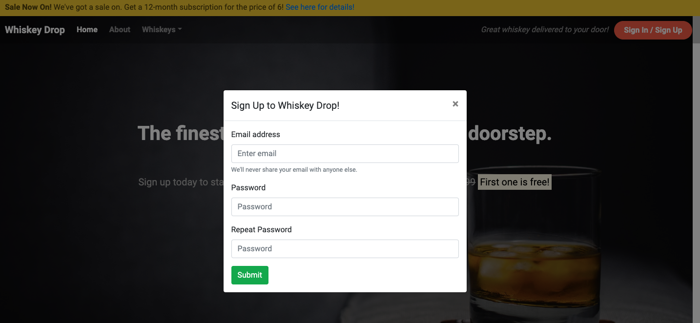
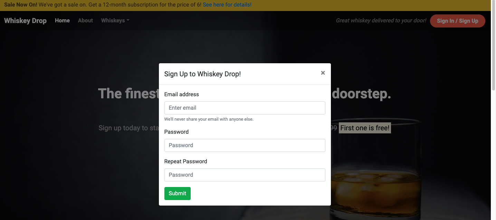

Bug fix: Modal opening caused content to "jump" - caused by default browser scrollbar being replaced by bootstrap/modal scrollbar. Fixed in style.css:  

.modal-scrollbar-measure {
    overflow: hidden !Important;
} /* This removes the scrollbar that bootstrap's modal inserts when modal is opened (which caused content to "jump" upon opening modal) */

.modal-open {
    overflow-y: auto;
} /* This allows background scroll when modal is open, results in default browser scollbar staying visible, fixes all content "jumps" when opening modal */  

Screenshots:  
Before:  

 
After:  
